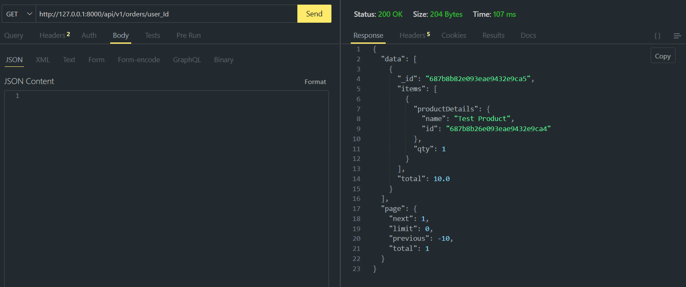

# E-commerce Backend API (FastAPI & MongoDB)

## Project Overview

This project is a sample e-commerce backend application built with FastAPI and Python, using MongoDB for data persistence. It implements core functionalities for managing products and customer orders as per the assignment requirements.

## Tech Stack

* **Python** (3.10+)
* **FastAPI**  
* **MongoDB** (via Pymongo)
* **Pydantic**
* **Uvicorn**

## Features & API Endpoints

The API provides the following endpoints under the `/api/v1` prefix:

* **`POST /products`**: Create a new product.
    * **Request Body:** `{"name": "string", "price": 100.0, "sizes": [{"size": "string", "quantity": 0}]}`
    * **Response:** `{"id": "string"}` (201 Created)
* **`GET /products`**: List products with optional filters and pagination.
    * **Query Params:** `name`, `size`, `limit`, `offset`
    * **Response:** `{"data": [], "page": {}}` (200 OK)
* **`POST /orders`**: Create a new customer order.
    * **Request Body:** `{"userId": "string", "items": [{"productId": "string", "qty": 0}]}`
    * **Response:** `{"id": "string"}` (201 Created)
* **`GET /orders/{user_id}`**: Get all orders for a specific user with optional pagination.
    * **Path Param:** `user_id`
    * **Query Params:** `limit`, `offset`
    * **Response:** `{"data": [], "page": {}}` (200 OK)

## Project Setup

### Prerequisites

* Python 3.10+ installed.
* MongoDB installed and running (local or MongoDB Atlas).

### Installation Steps

1.  **Clone the repository** (or create the `ecommerce_app` folder):
    ```bash
    git clone <repository_url_here> # If applicable
    cd ecommerce_app
    ```
2.  **Create and activate a virtual environment:**
    ```bash
    python -m venv venv
    # Windows: .\venv\Scripts\Activate.ps1
    # macOS/Linux: source venv/bin/activate
    ```
3.  **Install dependencies:**
    ```bash
    pip install fastapi uvicorn pymongo pydantic pydantic-settings
    ```
4.  **Configure MongoDB:** Create a `.env` file in the root directory and add your MongoDB connection string and database name:
    ```env
    MONGODB_URL="your_mongodb_connection_string"
    DATABASE_NAME="ecommerce"
    ```

## Running the Application

1.  Ensure your virtual environment is active.
2.  From the project root (`ecommerce_app`), run:
    ```bash
    uvicorn main:app --reload
    ```
    The API will be live at `http://127.0.0.1:8000`.

## API Usage & Testing

Access the interactive API documentation (Swagger UI) at:
`http://127.0.0.1:8000/docs`

* Use Swagger UI or Postman to interact with the endpoints.

**Testing Workflow:**

1.  **Create Products (`POST /api/v1/products`):**
    * Send a product creation request. Copy the `id` from the 201 response.
    

2.  **List Products (`GET /api/v1/products`):**
    * Request products without any query parameters to see all.
    

3.  **Create Order (`POST /api/v1/orders`):**
    * Send an order creation request, using the product `id` obtained above.
    

4.  **Get Orders for a User (`GET /api/v1/orders/{user_id}`):**
    * Request orders using the `userId` provided in the order creation step.
    

## Judging Criteria

The project will be evaluated based on:

* Code completeness and functionality as per specification.
* Code clarity, formatting, and documentation.
* Adherence to API request/response formats.
* MongoDB collection structure and query optimization.

## Potential Enhancements

* Authentication and Authorization.
* More robust error handling.
* Advanced stock management (transactions, specific size deduction).
* Product update/delete functionalities.
* Order status tracking.